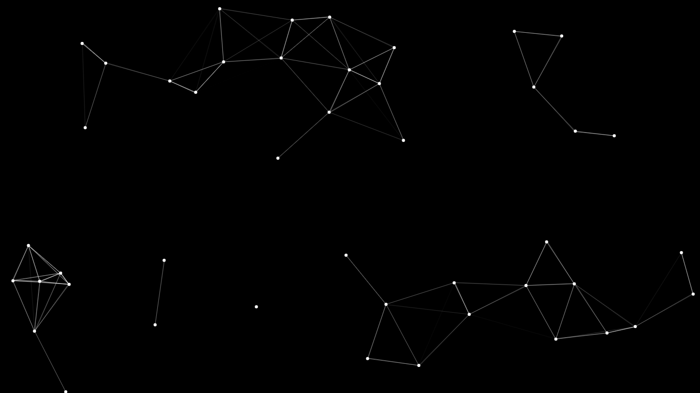

# Dynamic-Point-Mesh-Animation
A Dynamic Point Mesh Animation using HTML5 canvas.

* Random Particles Floating around the canvas.
* Creates a mesh between particles inside a certain range.
### Demo
<https://nadeemshakya.github.io/Dynamic-Point-Mesh-Animation/>
### ScreenShot

